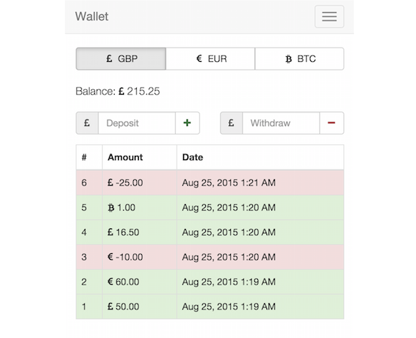

# Wallet

<p align="center">
  
</p>

A nice little wallet app built with React. Deployed at https://code.soulas.net/wallet/.

The responsive design was implemented with [React-Bootstrap](http://react-bootstrap.github.io/).

[](https://github.com/feross/standard)

## Installation

First make sure that you have `Git` and `npm` installed on your machine.

To setup the app, run those commands from your terminal:

```bash
git clone git@github.com:mehl321/wallet.git
cd wallet
npm install
```

To run the tests and build for production:

```bash
npm run build
# The artifact will be available in the /public directory
```

To just run tests:

```bash
npm run test
```

To run in development/watch mode:

```bash
npm run watch
# Then go to: http://localhost:8080/webpack-dev-server/
```
